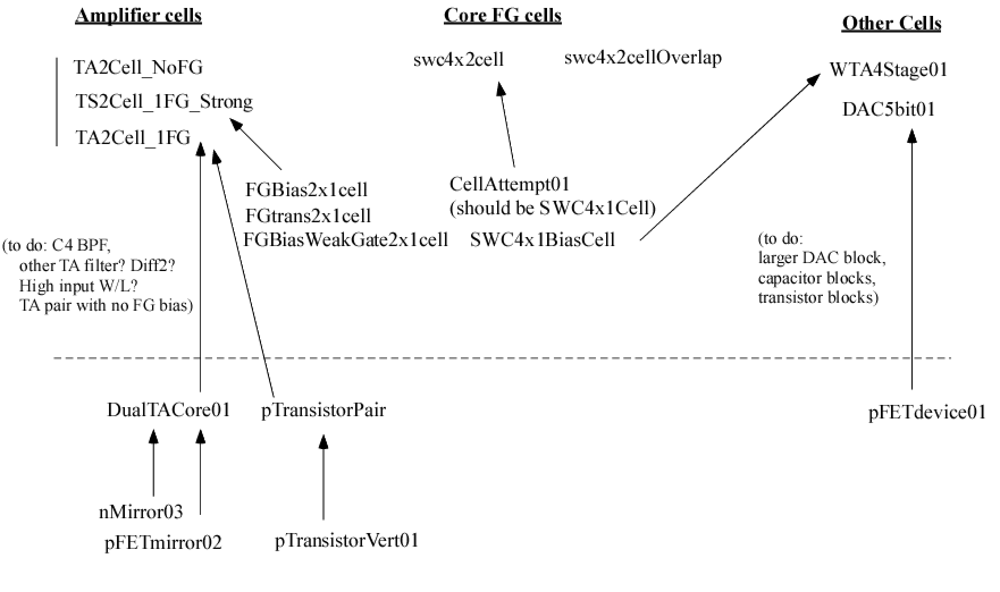

# Hilas Standard Cells
This repo contains a set of analog standard cells designed for the 
"Skywater 130nm" fabrication process available at the Google Skywater 
(formerly Cypress Semi.) foundry.

Here is a map:

