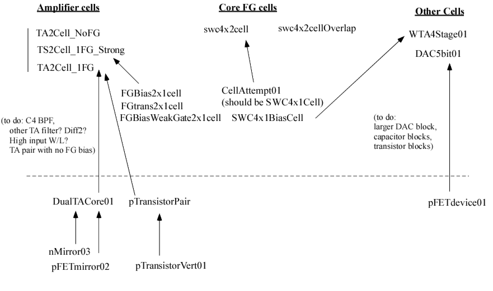

# -- Hilas Analog Standard Cells --

This repo contains a set of analog standard cells designed for the 
"Skywater 130nm" fabrication process available at the Google Skywater 
(formerly Cypress Semi.) foundry.

These cells can be used in the openLANE/openROAD toolchains in order
to create GDSII files for fabrication.

A custom version of the OpenLANE flow that we're calling "fastlane" is available on [gitlab.com](https://gitlab.com/um-ece/ftl-lab/hilas/fastlane)
 
[(git link)](https://gitlab.com/um-ece/ftl-lab/hilas/fastlane.git)

Fastlane uses git submodules to include this repository, so it's probably a better idea to start on the [Fastlane Page](https://gitlab.com/um-ece/ftl-lab/hilas/fastlane)

---

# PG (power/ground) and Interfacing
| Net Name  |     Description                    |
|-----------|------------------------------------|
| `VPWR`     | normal supply 1.8V (analog 1.8V)   |
| `VGND`     | reference 0                        |
| `VINJ`    | Supply for Injection for FG devices. (run time: 1.8V, programming: 1.8-6.0V) |
| `VTUN`    | Tunnelling input for FG devices. (run time: 0 or 1.8V, programming: 11-12V) |

---
---

# Cell Map:

---
---

# Standard Cells in this Library:

| Block Name                | Description                                             |
|---------------------------|---------------------------------------------------------|
| [`DAC5bit01`](#DAC5bit01) | 5-bit digital-to-analog converter (under 6.05um at the moment; thinking through expansion to 6bit and 7bit, and they would use this cell |
| [`DAC_bit6_01`](#DAC-bit6-01) | 6-bit DAC, first variant                                |
| [`DoubleTGate01`](#DoubleTGate01) | 2x1 array of transmission gates                         |
| [`FGHugeVaractorCapacitor01`](#FGHugeVaractorCapacitor01) | one large varactor cap                                  |
| [`FGVaractorCapacitor02`](#FGVaractorCapacitor02) | variant 2, varactor cap for floating-gate charge storage |
| [`TA2Cell_1FG_Strong`](#TA2Cell-1FG-Strong) | Core transimpedance amp; strong FG inputs.              |
| [`Tgate4Double01`](#Tgate4Double01) | 2x1 array of transmission gates (variant 4)             |
| [`Trans4small`](#Trans4small) | small transconductance amp?                             |
| [`WTA4stage01`](#WTA4stage01) | 4-input winner-take-all circuit. Connects directly to array of swc4x2cell. Can array vertically. Needs one current source. |
| [`capacitorArray01`](#capacitorArray01) | 2x8 array of capacitors                                 |
| [`swc4x1BiasCell`](#swc4x1BiasCell) | core switch cell 4x1 biasing unit                       |

# Primitive Cells in this Library:

| Block Name                | Description                                             |
|---------------------------|---------------------------------------------------------|
| [`CapModule01a`](#CapModule01a) | primitive cap, variant 01a                              |
| [`TunVaractorCapcitor`](#TunVaractorCapcitor) |                                                         |
| [`capacitorSize01`](#capacitorSize01) |                                                         |
| [`capacitorSize03`](#capacitorSize03) |                                                         |
| [`li2m2`](#li2m2) |                                                         |
| [`mcap2m4`](#mcap2m4) |                                                         |
| [`nFETLarge`](#nFETLarge) |                                                         |
| [`pFETLargePart1`](#pFETLargePart1) |                                                         |
| [`pFETdevice01`](#pFETdevice01) |                                                         |
| [`pFETdevice01aa`](#pFETdevice01aa) |                                                         |
| [`pFETdevice01e`](#pFETdevice01e) |                                                         |
| [`pFETmirror`](#pFETmirror) |                                                         |

# Test Cells in this Library:

| Block Name                | Description                                             |
|---------------------------|---------------------------------------------------------|
| [`all`](#all) |                                                         |

# Cell Details

## PUBLIC-CELLS

--------------------------------------------------------------------------------------------

### `DAC5bit01`

Description: 5-bit digital-to-analog converter (under 6.05um at the moment; thinking through expansion to 6bit and 7bit, and they would use this cell

Height: 5.970
 
Width: 16.580

| Port Number          | Label                | Layer                | Attributes           |
|----------------------|----------------------|----------------------|----------------------|
| 1                    | A0                   | metal2               | nsew,analog,default  |
| 2                    | A1                   | space                | nsew,analog,default  |
| 3                    | A2                   | metal2               | nsew,analog,default  |
| 4                    | A3                   | metal2               | nsew,analog,default  |
| 5                    | A4                   | metal2               | nsew,analog,default  |
| 6                    | VPWR                 | metal2               | nsew,analog,default  |
| 7                    | DRAIN                | metal1               | nsew,analog,default  |
--------------------------------------------------------------------------------------------

### `DAC_bit6_01`

Description: 6-bit DAC, first variant

Height: 13.680
 
Width: 16.380

| Port Number          | Label                | Layer                | Attributes           |
|----------------------|----------------------|----------------------|----------------------|
--------------------------------------------------------------------------------------------

### `DoubleTGate01`

Description: 2x1 array of transmission gates

Height: 6.050
 
Width: 5.420

| Port Number          | Label                | Layer                | Attributes           |
|----------------------|----------------------|----------------------|----------------------|
--------------------------------------------------------------------------------------------

### `FGHugeVaractorCapacitor01`

Description: one large varactor cap

Height: 5.990
 
Width: 10.290

| Port Number          | Label                | Layer                | Attributes           |
|----------------------|----------------------|----------------------|----------------------|
--------------------------------------------------------------------------------------------

### `FGVaractorCapacitor02`

Description: variant 2, varactor cap for floating-gate charge storage

Height: 1.690
 
Width: 2.720

| Port Number          | Label                | Layer                | Attributes           |
|----------------------|----------------------|----------------------|----------------------|
--------------------------------------------------------------------------------------------

### `TA2Cell_1FG_Strong`

Description: Core transimpedance amp; strong FG inputs.

Height: 6.050
 
Width: 28.100

| Port Number          | Label                | Layer                | Attributes           |
|----------------------|----------------------|----------------------|----------------------|
| 1                    | VINP_AMP2            | metal2               | nsew,analog,default  |
| 2                    | VINN_AMP2            | metal2               | n,analog,default     |
| 3                    | VPWR                 | metal1               | nsew,power,default   |
| 4                    | GATECOLSELECT        | metal1               | nsew,analog,default  |
| 5                    | VINP_AMP1            | metal1               | nsew,analog,default  |
| 6                    | VGND                 | metal1               | nsew,ground,default  |
| 7                    | OUTPUT2              | metal2               | nsew                 |
| 8                    | OUTPUT1              | metal2               | nsew,analog,default  |
| 9                    | VINJ                 | metal1               | nsew,power,default   |
--------------------------------------------------------------------------------------------

### `Tgate4Double01`

Description: 2x1 array of transmission gates (variant 4)

Height: 6.050
 
Width: 7.080

| Port Number          | Label                | Layer                | Attributes           |
|----------------------|----------------------|----------------------|----------------------|
| 1                    | VGND                 | metal1               | nsew                 |
| 2                    | INPUT1_1             | metal2               | nsew                 |
| 3                    | INPUT2_1             | metal2               | nsew                 |
| 4                    | SELECT1              | metal2               | nsew                 |
| 5                    | SELECT2              | metal2               | nsew                 |
| 6                    | INPUT2_2             | metal2               | nsew                 |
| 7                    | INPUT1_2             | metal2               | nsew                 |
| 8                    | SELECT3              | metal2               | nsew                 |
| 9                    | INPUT2_3             | metal2               | nsew                 |
| 10                   | SELECT4              | metal2               | nsew                 |
| 11                   | INPUT2_4             | metal2               | nsew                 |
| 12                   | INPUT1_4             | metal2               | nsew                 |
| 13                   | VPWR                 | metal1               | nsew                 |
| 14                   | OUTPUT4              | metal2               | nsew                 |
| 15                   | OUTPUT3              | metal2               | nsew                 |
| 16                   | OUTPUT2              | metal2               | nsew                 |
| 17                   | OUTPUT1              | metal2               | nsew                 |
--------------------------------------------------------------------------------------------

### `Trans4small`

Description: small transconductance amp?

Height: 5.880
 
Width: 2.800

| Port Number          | Label                | Layer                | Attributes           |
|----------------------|----------------------|----------------------|----------------------|
| 1                    | NFET_SOURCE1         | metal2               | nsew,analog,default  |
| 2                    | NFET_GATE1           | metal2               | nsew,analog,default  |
| 3                    | NFET_SOURCE2         | metal2               | nsew,analog,default  |
| 4                    | NFET_GATE2           | metal2               | nsew,analog,default  |
| 5                    | NFET_SOURCE3         | metal2               | nsew,analog,default  |
| 6                    | NFET_GATE3           | metal2               | nsew,analog,default  |
| 7                    | PFET_SOURCE1         | metal2               | nsew,analog,default  |
| 8                    | PFET_GATE1           | metal2               | nsew,analog,default  |
| 9                    | PFET_SOURCE2         | metal2               | nsew,analog,default  |
| 10                   | PFET_GATE2           | metal2               | nsew,analog,default  |
| 11                   | PFET_SOURCE3         | metal2               | nsew,analog,default  |
| 12                   | PFET_GATE3           | metal2               | nsew,analog,default  |
| 13                   | WELL                 | metal1               | nsew,ground,default  |
| 14                   | VGND                 | metal1               | nsew,power,default   |
| 15                   | PFET_DRAIN3          | metal2               | nsew,analog,default  |
| 16                   | PFET_DRAIN2          | metal2               | nsew,analog,default  |
| 17                   | PFET_DRAIN1          | metal2               | nsew,analog,default  |
| 18                   | NFET_DRAIN3          | metal2               | nsew,analog,default  |
| 19                   | NFET_DRAIN2          | metal2               | nsew,analog,default  |
| 20                   | NFET_DRAIN1          | metal2               | nsew,analog,default  |
--------------------------------------------------------------------------------------------

### `WTA4stage01`

Description: 4-input winner-take-all circuit. Connects directly to array of swc4x2cell. Can array vertically. Needs one current source.

Height: 5.340
 
Width: 2.830

| Port Number          | Label                | Layer                | Attributes           |
|----------------------|----------------------|----------------------|----------------------|
--------------------------------------------------------------------------------------------

### `capacitorArray01`

Description: 2x8 array of capacitors

Height: 6.050
 
Width: 36.700

| Port Number          | Label                | Layer                | Attributes           |
|----------------------|----------------------|----------------------|----------------------|
| 1                    | CAPTERMINAL2         | metal2               | nsew,analog,default  |
| 2                    | CAPTERM01            | metal2               | nsew,analog,default  |
| 3                    | VINJ                 | metal1               | nsew,power,default   |
| 4                    | GATESELECT           | metal1               | nsew                 |
| 5                    | VTUN                 | metal1               | nsew                 |
| 6                    | GATE                 | metal1               | nsew,analog,default  |
--------------------------------------------------------------------------------------------

### `swc4x1BiasCell`

Description: core switch cell 4x1 biasing unit

Height: 6.050
 
Width: 10.110

| Port Number          | Label                | Layer                | Attributes           |
|----------------------|----------------------|----------------------|----------------------|
| 1                    | BIAS1                | metal2               | nsew,analog,default  |
| 2                    | BIAS2                | metal2               | nsew,analog,default  |
| 3                    | BIAS3                | metal2               | nsew,analog,default  |
| 4                    | BIAS4                | metal2               | nsew,analog,default  |
| 5                    | VTUN                 | metal1               | nsew,analog,default  |
| 6                    | GATE                 | metal1               | nsew,analog,default  |
| 7                    | VINJ                 | metal1               | nsew,power,default   |
| 8                    | VPWR                 | metal1               | nsew,power,default   |
| 9                    | GATESELECT           | metal1               | nsew,analog,default  |
| 10                   | DRAIN1               | metal2               | nsew,analog,default  |
| 11                   | HORIZ1               | metal2               | nsew,analog,default  |
| 12                   | HORIZ2               | metal2               | nsew,analog,default  |
| 13                   | DRAIN2               | metal2               | nsew                 |
| 14                   | DRAIN3               | metal2               | nsew,analog,default  |
| 15                   | HORIZ3               | metal2               | nsew,analog,default  |
| 16                   | HORIZ4               | metal2               | nsew,analog,default  |
| 17                   | DRAIN4               | metal2               | nsew,analog,default  |
## PRIMITIVE-CELLS

--------------------------------------------------------------------------------------------

### `CapModule01a`

Description: primitive cap, variant 01a

Height: 2.280
 
Width: 2.300

| Port Number          | Label                | Layer                | Attributes           |
|----------------------|----------------------|----------------------|----------------------|
--------------------------------------------------------------------------------------------

### `TunVaractorCapcitor`

Description: None

Height: 7.010
 
Width: 10.430

| Port Number          | Label                | Layer                | Attributes           |
|----------------------|----------------------|----------------------|----------------------|
--------------------------------------------------------------------------------------------

### `capacitorSize01`

Description: None

Height: 5.830
 
Width: 10.420

| Port Number          | Label                | Layer                | Attributes           |
|----------------------|----------------------|----------------------|----------------------|
| 1                    | CAPTERM02            | metal2               | nsew,analog,default  |
| 2                    | CAPTERM01            | metal2               | nsew,analog,default  |
--------------------------------------------------------------------------------------------

### `capacitorSize03`

Description: None

Height: 5.870
 
Width: 5.790

| Port Number          | Label                | Layer                | Attributes           |
|----------------------|----------------------|----------------------|----------------------|
| 1                    | CAPTERM02            | metal2               | nsew,analog,default  |
| 2                    | CAPTERM01            | metal2               | nsew,analog,default  |
--------------------------------------------------------------------------------------------

### `li2m2`

Description: None

Height: 0.330
 
Width: 0.340

| Port Number          | Label                | Layer                | Attributes           |
|----------------------|----------------------|----------------------|----------------------|
--------------------------------------------------------------------------------------------

### `mcap2m4`

Description: None

Height: 0.750
 
Width: 0.790

| Port Number          | Label                | Layer                | Attributes           |
|----------------------|----------------------|----------------------|----------------------|
--------------------------------------------------------------------------------------------

### `nFETLarge`

Description: None

Height: 5.830
 
Width: 4.370

| Port Number          | Label                | Layer                | Attributes           |
|----------------------|----------------------|----------------------|----------------------|
| 1                    | GATE                 | metal2               | nsew,analog,default  |
| 2                    | SOURCE               | metal2               | nsew,analog,default  |
| 3                    | DRAIN                | metal2               | nsew,analog,default  |
--------------------------------------------------------------------------------------------

### `pFETLargePart1`

Description: None

Height: 2.870
 
Width: 3.390

| Port Number          | Label                | Layer                | Attributes           |
|----------------------|----------------------|----------------------|----------------------|
--------------------------------------------------------------------------------------------

### `pFETdevice01`

Description: None

Height: 1.210
 
Width: 1.610

| Port Number          | Label                | Layer                | Attributes           |
|----------------------|----------------------|----------------------|----------------------|
--------------------------------------------------------------------------------------------

### `pFETdevice01aa`

Description: None

Height: 1.210
 
Width: 1.720

| Port Number          | Label                | Layer                | Attributes           |
|----------------------|----------------------|----------------------|----------------------|
--------------------------------------------------------------------------------------------

### `pFETdevice01e`

Description: None

Height: 0.990
 
Width: 2.030

| Port Number          | Label                | Layer                | Attributes           |
|----------------------|----------------------|----------------------|----------------------|
--------------------------------------------------------------------------------------------

### `pFETmirror`

Description: None

Height: 2.030
 
Width: 2.190

| Port Number          | Label                | Layer                | Attributes           |
|----------------------|----------------------|----------------------|----------------------|
## TEST-CELLS

--------------------------------------------------------------------------------------------

### `all`

Description: None

Height: 6.670
 
Width: 1.770

| Port Number          | Label                | Layer                | Attributes           |
|----------------------|----------------------|----------------------|----------------------|
## PRIVATE-CELLS

--------------------------------------------------------------------------------------------

### `nDiffThOxContact`

Description: None

Height: 0.290
 
Width: 0.670

| Port Number          | Label                | Layer                | Attributes           |
|----------------------|----------------------|----------------------|----------------------|
## CELLS-TO-BE-SORTED

--------------------------------------------------------------------------------------------

### `CapModule01`

Description: None

Height: 2.860
 
Width: 2.840

| Port Number          | Label                | Layer                | Attributes           |
|----------------------|----------------------|----------------------|----------------------|
--------------------------------------------------------------------------------------------

### `CapModule02`

Description: None

Height: 5.830
 
Width: 7.200

| Port Number          | Label                | Layer                | Attributes           |
|----------------------|----------------------|----------------------|----------------------|
--------------------------------------------------------------------------------------------

### `CapModule03`

Description: None

Height: 5.830
 
Width: 4.230

| Port Number          | Label                | Layer                | Attributes           |
|----------------------|----------------------|----------------------|----------------------|
--------------------------------------------------------------------------------------------

### `DAC6TransistorStack01`

Description: None

Height: 5.650
 
Width: 1.720

| Port Number          | Label                | Layer                | Attributes           |
|----------------------|----------------------|----------------------|----------------------|
--------------------------------------------------------------------------------------------

### `DAC6TransistorStack01a`

Description: None

Height: 5.650
 
Width: 1.720

| Port Number          | Label                | Layer                | Attributes           |
|----------------------|----------------------|----------------------|----------------------|
--------------------------------------------------------------------------------------------

### `DAC6TransistorStack01b`

Description: None

Height: 5.650
 
Width: 1.850

| Port Number          | Label                | Layer                | Attributes           |
|----------------------|----------------------|----------------------|----------------------|
--------------------------------------------------------------------------------------------

### `DAC6TransistorStack01c`

Description: None

Height: 5.650
 
Width: 1.870

| Port Number          | Label                | Layer                | Attributes           |
|----------------------|----------------------|----------------------|----------------------|
--------------------------------------------------------------------------------------------

### `DAC6bit01`

Description: None

Height: 13.680
 
Width: 33.400

| Port Number          | Label                | Layer                | Attributes           |
|----------------------|----------------------|----------------------|----------------------|
--------------------------------------------------------------------------------------------

### `DualTACore01`

Description: None

Height: 5.720
 
Width: 3.270

| Port Number          | Label                | Layer                | Attributes           |
|----------------------|----------------------|----------------------|----------------------|
--------------------------------------------------------------------------------------------

### `FGBias2x1cell`

Description: None

Height: 6.050
 
Width: 11.530

| Port Number          | Label                | Layer                | Attributes           |
|----------------------|----------------------|----------------------|----------------------|
| 1                    | VTUN                 | metal1               | nsew,analog,default  |
| 2                    | VGND                 | metal1               | nsew,ground,default  |
| 4                    | GATE_CONTROL         | metal1               | nsew,analog,default  |
| 5                    | DRAIN1               | metal2               | nsew,analog,default  |
| 6                    | DRAIN4               | metal2               | nsew,analog,default  |
| 7                    | VINJ                 | metal1               | nsew,power,default   |
| 8                    | OUTPUT1              | metal2               | nsew,analog,default  |
| 9                    | OUTPUT2              | metal2               | nsew,analog,default  |
--------------------------------------------------------------------------------------------

### `FGBiasWeakGate2x1cell`

Description: None

Height: 6.050
 
Width: 11.530

| Port Number          | Label                | Layer                | Attributes           |
|----------------------|----------------------|----------------------|----------------------|
| 1                    | DRAIN1               | metal2               | nsew,analog,default  |
| 2                    | INPUT1               | metal2               | nsew                 |
| 3                    | OUTPUT1              | metal2               | nsew,analog,default  |
| 4                    | OUTPUT2              | metal2               | nsew,analog,default  |
| 5                    | VINJ                 | metal1               | nsew,power,default   |
| 6                    | GATESELECT           | metal1               | nsew,analog,default  |
| 7                    | VGND                 | metal1               | nsew,ground,default  |
| 8                    | GATE_CONTROL         | metal1               | nsew,analog,default  |
| 9                    | VTUN                 | metal1               | nsew,analog,default  |
| 10                   | GATECONTROL          | metal1               | nsew,analog,default  |
| 11                   | DRAIN4               | metal2               | nsew,analog,default  |
| 12                   | INPUT2               | metal2               | nsew,analog,default  |
| 13                   | COMMONSOURCE         | metal2               | nsew,analog,default  |
--------------------------------------------------------------------------------------------

### `FGVaractorCapacitor`

Description: None

Height: 1.860
 
Width: 2.230

| Port Number          | Label                | Layer                | Attributes           |
|----------------------|----------------------|----------------------|----------------------|
--------------------------------------------------------------------------------------------

### `FGVaractorTunnelCap01`

Description: None

Height: 1.690
 
Width: 2.220

| Port Number          | Label                | Layer                | Attributes           |
|----------------------|----------------------|----------------------|----------------------|
--------------------------------------------------------------------------------------------

### `FGcharacterization01`

Description: None

Height: 6.050
 
Width: 29.950

| Port Number          | Label                | Layer                | Attributes           |
|----------------------|----------------------|----------------------|----------------------|
| 1                    | VTUNVARACTOR01       | metal1               | nsew,analog,default  |
| 2                    | VARACTORCAP01        | metal1               | nsew,analog,default  |
| 3                    | OVERLAPCAP01         | metal1               | nsew,analog,default  |
| 4                    | VTUNOVERLAP01        | space                | nsew,analog,default  |
| 5                    | VARACTORCAP02        | metal1               | nsew,analog,default  |
| 6                    | OVERLAPCAP02         | metal1               | nsew,analog,default  |
| 7                    | LARGECAPACITOR       | metal1               | nsew,analog,default  |
| 8                    | VGND                 | metal2               | nsew,ground,default  |
| 9                    | VINJ                 | metal2               | nsew,power,default   |
| 10                   | OUTPUT               | metal2               | nsew,analog,default  |
| 11                   | VREF                 | metal2               | nsew,analog,default  |
| 12                   | AMPLIFIERBIAS        | metal2               | nsew,analog,default  |
--------------------------------------------------------------------------------------------

### `FGtrans2x1cell`

Description: None

Height: 6.050
 
Width: 11.520

| Port Number          | Label                | Layer                | Attributes           |
|----------------------|----------------------|----------------------|----------------------|
| 1                    | GATESELECT           | metal1               | nsew,analog,default  |
| 2                    | VINJ                 | metal1               | nsew,analog,default  |
| 3                    | DRAIN1               | metal2               | nsew,analog,default  |
| 4                    | DRAIN4               | metal2               | nsew,analog,default  |
| 5                    | PROG                 | metal1               | nsew,analog,default  |
| 6                    | RUN                  | metal1               | nsew,analog,default  |
| 7                    | GATE1                | metal1               | nsew,analog,default  |
| 8                    | GATE2                | metal1               | nsew,analog,default  |
| 9                    | PROGGATE             | metal1               | nsew,analog,default  |
| 10                   | VGND                 | metal1               | nsew,ground,default  |
| 11                   | VTUN                 | metal1               | nsew,analog,default  |
| 12                   | FGDRAINPROGRAM2      | metal2               | e,analog,default     |
| 13                   | DRAIN                | metal2               | e,analog,default     |
| 14                   | VS                   | metal2               | nsew,analog,default  |
| 15                   | FGDRAINPROGRAM1      | metal2               | nsew,analog,default  |
--------------------------------------------------------------------------------------------

### `TA2Cell_1FG`

Description: Core transimpedance amp; floating-gate inputs. (C4 block is a specific routing of this cell&#39;s terminals)

Height: 6.050
 
Width: 28.090

| Port Number          | Label                | Layer                | Attributes           |
|----------------------|----------------------|----------------------|----------------------|
| 1                    | VINN_AMP1            | space                | nsew,analog,default  |
| 2                    | VINP_AMP1            | metal2               | nsew,analog,default  |
| 3                    | VINP_AMP2            | metal2               | nsew,analog,default  |
| 4                    | VINN_AMP2            | metal2               | n,analog,default     |
| 5                    | GATECOLSELECT        | metal1               | nsew,analog,default  |
| 6                    | VPWR                 | metal1               | nsew,power,default   |
| 7                    | VGND                 | metal1               | nsew,ground,default  |
| 8                    | VINJ                 | metal1               | nsew,power,default   |
| 9                    | OUTPUT1              | metal2               | nsew,analog,default  |
| 10                   | OUTPUT2              | metal2               | nsew,analog,default  |
--------------------------------------------------------------------------------------------

### `TA2Cell_NoFG`

Description: Core transimpedance amplifier

Height: 6.050
 
Width: 17.920

| Port Number          | Label                | Layer                | Attributes           |
|----------------------|----------------------|----------------------|----------------------|
| 1                    | GATECOLSELECT        | metal1               | nsew                 |
| 2                    | VINN_AMP1            | metal2               | nsew,analog,default  |
| 3                    | VINP_AMP2            | metal2               | nsew                 |
| 4                    | VINN_AMP2            | metal2               | nsew                 |
| 5                    | VOUT_AMP1            | metal2               | nsew                 |
| 6                    | VOUT_AMP2            | metal2               | nsew                 |
| 7                    | VGND                 | metal1               | nsew,ground,default  |
| 8                    | VPWR                 | metal1               | nsew,power,default   |
--------------------------------------------------------------------------------------------

### `TA2SignalBiasCell`

Description: None

Height: 6.050
 
Width: 8.450

| Port Number          | Label                | Layer                | Attributes           |
|----------------------|----------------------|----------------------|----------------------|
| 1                    | VOUT_AMP2            | metal2               | nsew,analog,default  |
| 2                    | VOUT_AMP1            | metal2               | nsew,analog,default  |
| 3                    | VGND                 | metal1               | nsew,ground,default  |
| 4                    | VPWR                 | metal2               | nsew,power,default   |
| 5                    | VINN_AMP2            | metal2               | nsew,analog,default  |
| 6                    | VINP_AMP2            | metal2               | nsew,analog,default  |
| 7                    | VINP_AMP1            | metal2               | nsew,analog,default  |
| 8                    | VINN_AMP1            | metal2               | nsew,analog,default  |
| 9                    | VBIAS2               | metal2               | nsew,analog,default  |
| 10                   | VBIAS1               | metal2               | nsew,analog,default  |
--------------------------------------------------------------------------------------------

### `TACoreBlock`

Description: None

Height: 5.020
 
Width: 9.540

| Port Number          | Label                | Layer                | Attributes           |
|----------------------|----------------------|----------------------|----------------------|
--------------------------------------------------------------------------------------------

### `TACoreBlock2`

Description: None

Height: 4.770
 
Width: 2.190

| Port Number          | Label                | Layer                | Attributes           |
|----------------------|----------------------|----------------------|----------------------|
--------------------------------------------------------------------------------------------

### `TAcoreblock`

Description: None

Height: 4.770
 
Width: 2.190

| Port Number          | Label                | Layer                | Attributes           |
|----------------------|----------------------|----------------------|----------------------|
--------------------------------------------------------------------------------------------

### `Tgate4Single01`

Description: None

Height: 6.050
 
Width: 4.760

| Port Number          | Label                | Layer                | Attributes           |
|----------------------|----------------------|----------------------|----------------------|
| 1                    | INPUT1_4             | metal2               | nsew,analog,default  |
| 2                    | VPWR                 | metal1               | nsew,power,default   |
| 3                    | SELECT4              | metal2               | nsew,analog,default  |
| 4                    | SELECT3              | metal2               | nsew,analog,default  |
| 5                    | INPUT1_3             | metal2               | nsew,analog,default  |
| 6                    | INPUT1_2             | metal2               | nsew,analog,default  |
| 7                    | SELECT2              | metal2               | nsew,analog,default  |
| 8                    | SELECT1              | metal2               | nsew,analog,default  |
| 9                    | INPUT1_1             | metal2               | nsew,analog,default  |
| 10                   | VGND                 | metal1               | nsew,ground,default  |
| 11                   | OUTPUT1              | metal2               | nsew,analog,default  |
| 12                   | OUTPUT2              | metal2               | nsew,analog,default  |
| 13                   | OUTPUT3              | metal2               | nsew,analog,default  |
| 14                   | OUTPUT4              | metal2               | nsew,analog,default  |
--------------------------------------------------------------------------------------------

### `TgateDouble01`

Description: None

Height: 1.520
 
Width: 7.080

| Port Number          | Label                | Layer                | Attributes           |
|----------------------|----------------------|----------------------|----------------------|
--------------------------------------------------------------------------------------------

### `TgateSingle01`

Description: None

Height: 1.520
 
Width: 4.760

| Port Number          | Label                | Layer                | Attributes           |
|----------------------|----------------------|----------------------|----------------------|
--------------------------------------------------------------------------------------------

### `TgateSingle01Part1`

Description: None

Height: 1.520
 
Width: 1.880

| Port Number          | Label                | Layer                | Attributes           |
|----------------------|----------------------|----------------------|----------------------|
--------------------------------------------------------------------------------------------

### `TgateSingle01Part2`

Description: None

Height: 1.430
 
Width: 1.630

| Port Number          | Label                | Layer                | Attributes           |
|----------------------|----------------------|----------------------|----------------------|
--------------------------------------------------------------------------------------------

### `TgateVinj01`

Description: None

Height: 1.590
 
Width: 5.420

| Port Number          | Label                | Layer                | Attributes           |
|----------------------|----------------------|----------------------|----------------------|
--------------------------------------------------------------------------------------------

### `Trans2med`

Description: None

Height: 5.950
 
Width: 3.530

| Port Number          | Label                | Layer                | Attributes           |
|----------------------|----------------------|----------------------|----------------------|
| 1                    | NFET_GATE01          | metal2               | nsew,analog,default  |
| 2                    | PET_GATE02           | metal2               | nsew,analog,default  |
| 3                    | PFET_GATE01          | metal2               | nsew,analog,default  |
| 4                    | NFET_GATE02          | metal2               | nsew,analog,default  |
| 5                    | PFET_SOURCE1         | metal2               | nsew,analog,default  |
| 6                    | PFET_SOURCE2         | metal2               | nsew,analog,default  |
| 7                    | NFET_SOURCE2         | metal2               | nsew,analog,default  |
| 8                    | NFET_SOURCE1         | metal2               | nsew,analog,default  |
| 9                    | NFET_DRAIN1          | metal2               | nsew,analog,default  |
| 10                   | NFET_DRAIN2          | metal2               | nsew,analog,default  |
| 11                   | PFET_DRAIN01         | metal2               | nsew,analog,default  |
| 12                   | PFET_DRAIN2          | metal2               | nsew,analog,default  |
--------------------------------------------------------------------------------------------

### `TunCap01`

Description: None

Height: 1.900
 
Width: 1.730

| Port Number          | Label                | Layer                | Attributes           |
|----------------------|----------------------|----------------------|----------------------|
--------------------------------------------------------------------------------------------

### `WTA4Stage01`

Description: None

Height: 6.050
 
Width: 14.170

| Port Number          | Label                | Layer                | Attributes           |
|----------------------|----------------------|----------------------|----------------------|
| 1                    | VGND                 | metal1               | nsew,ground,default  |
| 2                    | COMMONNODE           | metal1               | nsew,analog,default  |
| 3                    | COMMONMODE           | poly                 | nsew,analog,default  |
| 4                    | OUTPUT1              | metal2               | nsew,analog,default  |
| 5                    | OUTPUT2              | metal2               | nsew,analog,default  |
| 6                    | OUTPUT3              | metal2               | nsew,analog,default  |
| 7                    | OUTPUT4              | metal2               | nsew,analog,default  |
| 8                    | INPUT1               | metal2               | nsew,analog,default  |
| 9                    | INPUT2               | metal2               | nsew,analog,default  |
| 10                   | INPUT3               | metal2               | nsew,analog,default  |
| 11                   | INPUT4               | metal2               | nsew,analog,default  |
--------------------------------------------------------------------------------------------

### `WTAblockSample01`

Description: None

Height: 12.030
 
Width: 33.420

| Port Number          | Label                | Layer                | Attributes           |
|----------------------|----------------------|----------------------|----------------------|
--------------------------------------------------------------------------------------------

### `WTAsinglestage01`

Description: None

Height: 1.430
 
Width: 2.830

| Port Number          | Label                | Layer                | Attributes           |
|----------------------|----------------------|----------------------|----------------------|
--------------------------------------------------------------------------------------------

### `capacitorSize02`

Description: None

Height: 5.830
 
Width: 7.970

| Port Number          | Label                | Layer                | Attributes           |
|----------------------|----------------------|----------------------|----------------------|
| 1                    | CAPTERM02            | metal2               | nsew,analog,default  |
| 2                    | CAPTERM01            | metal2               | nsew,analog,default  |
--------------------------------------------------------------------------------------------

### `capacitorSize04`

Description: None

Height: 5.290
 
Width: 5.780

| Port Number          | Label                | Layer                | Attributes           |
|----------------------|----------------------|----------------------|----------------------|
| 1                    | CAP1TERM02           | metal2               | nsew,analog,default  |
| 2                    | CAP2TERM02           | metal2               | nsew,analog,default  |
| 3                    | CAP2TERM01           | metal2               | nsew,analog,default  |
| 4                    | CAP1TERM01           | metal2               | nsew,analog,default  |
--------------------------------------------------------------------------------------------

### `cellAttempt01`

Description: None

Height: 6.050
 
Width: 10.080

| Port Number          | Label                | Layer                | Attributes           |
|----------------------|----------------------|----------------------|----------------------|
--------------------------------------------------------------------------------------------

### `drainSelect01`

Description: None

Height: 6.050
 
Width: 5.420

| Port Number          | Label                | Layer                | Attributes           |
|----------------------|----------------------|----------------------|----------------------|
| 1                    | DRAIN4               | metal2               | nsew                 |
| 2                    | DRAIN3               | metal2               | nsew                 |
| 3                    | DRAIN2               | metal2               | nsew,analog,default  |
| 4                    | DRAIN1               | metal2               | nsew,analog,default  |
| 5                    | DRAINSELECT1         | metal1               | nsew,analog,default  |
| 6                    | DRAINSELECT2         | metal1               | nsew,analog,default  |
| 7                    | DRAINSELECT3         | metal1               | nsew,analog,default  |
| 8                    | DRAINSELECT4         | metal1               | nsew,analog,default  |
| 9                    | VINJ                 | metal1               | nsew,power,default   |
| 10                   | DRAIN_MUX            | metal1               | nsew,analog,default  |
| 11                   | VGND                 | metal1               | nsew,ground,default  |
--------------------------------------------------------------------------------------------

### `horizPcell01`

Description: None

Height: 1.850
 
Width: 2.560

| Port Number          | Label                | Layer                | Attributes           |
|----------------------|----------------------|----------------------|----------------------|
--------------------------------------------------------------------------------------------

### `horizTransCell01`

Description: None

Height: 3.110
 
Width: 4.430

| Port Number          | Label                | Layer                | Attributes           |
|----------------------|----------------------|----------------------|----------------------|
--------------------------------------------------------------------------------------------

### `invert01`

Description: None

Height: 0.310
 
Width: 0.520

| Port Number          | Label                | Layer                | Attributes           |
|----------------------|----------------------|----------------------|----------------------|
--------------------------------------------------------------------------------------------

### `li2m1`

Description: None

Height: 0.290
 
Width: 0.230

| Port Number          | Label                | Layer                | Attributes           |
|----------------------|----------------------|----------------------|----------------------|
--------------------------------------------------------------------------------------------

### `m12m2`

Description: None

Height: 0.320
 
Width: 0.320

| Port Number          | Label                | Layer                | Attributes           |
|----------------------|----------------------|----------------------|----------------------|
--------------------------------------------------------------------------------------------

### `m22m4`

Description: None

Height: 0.750
 
Width: 0.790

| Port Number          | Label                | Layer                | Attributes           |
|----------------------|----------------------|----------------------|----------------------|
--------------------------------------------------------------------------------------------

### `nFET03`

Description: None

Height: 0.610
 
Width: 0.890

| Port Number          | Label                | Layer                | Attributes           |
|----------------------|----------------------|----------------------|----------------------|
--------------------------------------------------------------------------------------------

### `nFET03a`

Description: None

Height: 0.890
 
Width: 2.080

| Port Number          | Label                | Layer                | Attributes           |
|----------------------|----------------------|----------------------|----------------------|
--------------------------------------------------------------------------------------------

### `nFETLargePart1`

Description: None

Height: 2.720
 
Width: 3.020

| Port Number          | Label                | Layer                | Attributes           |
|----------------------|----------------------|----------------------|----------------------|
--------------------------------------------------------------------------------------------

### `nFETmed`

Description: None

Height: 2.720
 
Width: 0.820

| Port Number          | Label                | Layer                | Attributes           |
|----------------------|----------------------|----------------------|----------------------|
--------------------------------------------------------------------------------------------

### `nFETmirrorPairs`

Description: None

Height: 2.750
 
Width: 1.660

| Port Number          | Label                | Layer                | Attributes           |
|----------------------|----------------------|----------------------|----------------------|
--------------------------------------------------------------------------------------------

### `nFETmirrorPairs2`

Description: None

Height: 4.770
 
Width: 4.670

| Port Number          | Label                | Layer                | Attributes           |
|----------------------|----------------------|----------------------|----------------------|
--------------------------------------------------------------------------------------------

### `nMirror03`

Description: None

Height: 1.270
 
Width: 1.840

| Port Number          | Label                | Layer                | Attributes           |
|----------------------|----------------------|----------------------|----------------------|
--------------------------------------------------------------------------------------------

### `nOverlapCap01`

Description: None

Height: 1.290
 
Width: 1.290

| Port Number          | Label                | Layer                | Attributes           |
|----------------------|----------------------|----------------------|----------------------|
--------------------------------------------------------------------------------------------

### `overlapCap01`

Description: None

Height: 2.080
 
Width: 2.870

| Port Number          | Label                | Layer                | Attributes           |
|----------------------|----------------------|----------------------|----------------------|
--------------------------------------------------------------------------------------------

### `overlapCap02`

Description: None

Height: 1.950
 
Width: 4.320

| Port Number          | Label                | Layer                | Attributes           |
|----------------------|----------------------|----------------------|----------------------|
--------------------------------------------------------------------------------------------

### `overlapCap02a`

Description: None

Height: 1.640
 
Width: 4.000

| Port Number          | Label                | Layer                | Attributes           |
|----------------------|----------------------|----------------------|----------------------|
--------------------------------------------------------------------------------------------

### `pFETLarge`

Description: None

Height: 5.990
 
Width: 4.640

| Port Number          | Label                | Layer                | Attributes           |
|----------------------|----------------------|----------------------|----------------------|
| 1                    | GATE                 | metal2               | nsew                 |
| 2                    | SOURCE               | metal2               | nsew,analog,default  |
| 3                    | DRAIN                | metal2               | nsew,analog,default  |
| 4                    | WELL                 | metal1               | nsew,analog,default  |
--------------------------------------------------------------------------------------------

### `pFETdevice01a`

Description: None

Height: 0.850
 
Width: 1.610

| Port Number          | Label                | Layer                | Attributes           |
|----------------------|----------------------|----------------------|----------------------|
--------------------------------------------------------------------------------------------

### `pFETdevice01b`

Description: None

Height: 1.570
 
Width: 1.870

| Port Number          | Label                | Layer                | Attributes           |
|----------------------|----------------------|----------------------|----------------------|
--------------------------------------------------------------------------------------------

### `pFETdevice01ba`

Description: None

Height: 1.570
 
Width: 1.870

| Port Number          | Label                | Layer                | Attributes           |
|----------------------|----------------------|----------------------|----------------------|
--------------------------------------------------------------------------------------------

### `pFETdevice01c`

Description: None

Height: 1.570
 
Width: 1.870

| Port Number          | Label                | Layer                | Attributes           |
|----------------------|----------------------|----------------------|----------------------|
--------------------------------------------------------------------------------------------

### `pFETdevice01d`

Description: None

Height: 1.450
 
Width: 1.840

| Port Number          | Label                | Layer                | Attributes           |
|----------------------|----------------------|----------------------|----------------------|
--------------------------------------------------------------------------------------------

### `pFETmed`

Description: None

Height: 2.870
 
Width: 1.190

| Port Number          | Label                | Layer                | Attributes           |
|----------------------|----------------------|----------------------|----------------------|
--------------------------------------------------------------------------------------------

### `pFETmirror02`

Description: None

Height: 2.840
 
Width: 1.280

| Port Number          | Label                | Layer                | Attributes           |
|----------------------|----------------------|----------------------|----------------------|
--------------------------------------------------------------------------------------------

### `pTransistorPair`

Description: None

Height: 6.050
 
Width: 1.870

| Port Number          | Label                | Layer                | Attributes           |
|----------------------|----------------------|----------------------|----------------------|
--------------------------------------------------------------------------------------------

### `pTransistorVert01`

Description: None

Height: 2.990
 
Width: 1.860

| Port Number          | Label                | Layer                | Attributes           |
|----------------------|----------------------|----------------------|----------------------|
--------------------------------------------------------------------------------------------

### `poly2li`

Description: None

Height: 0.330
 
Width: 0.270

| Port Number          | Label                | Layer                | Attributes           |
|----------------------|----------------------|----------------------|----------------------|
--------------------------------------------------------------------------------------------

### `poly2m1`

Description: None

Height: 0.510
 
Width: 0.330

| Port Number          | Label                | Layer                | Attributes           |
|----------------------|----------------------|----------------------|----------------------|
--------------------------------------------------------------------------------------------

### `poly2m2`

Description: None

Height: 0.550
 
Width: 0.330

| Port Number          | Label                | Layer                | Attributes           |
|----------------------|----------------------|----------------------|----------------------|
--------------------------------------------------------------------------------------------

### `swc2x2varactor`

Description: None

Height: 7.010
 
Width: 14.680

| Port Number          | Label                | Layer                | Attributes           |
|----------------------|----------------------|----------------------|----------------------|
--------------------------------------------------------------------------------------------

### `swc4x1cellOverlap`

Description: None

Height: 6.710
 
Width: 10.080

| Port Number          | Label                | Layer                | Attributes           |
|----------------------|----------------------|----------------------|----------------------|
--------------------------------------------------------------------------------------------

### `swc4x1cellOverlap2`

Description: None

Height: 6.050
 
Width: 9.350

| Port Number          | Label                | Layer                | Attributes           |
|----------------------|----------------------|----------------------|----------------------|
--------------------------------------------------------------------------------------------

### `swc4x2cell`

Description: Core switch cell ,Varactor capacitor cell

Height: 6.050
 
Width: 20.130

| Port Number          | Label                | Layer                | Attributes           |
|----------------------|----------------------|----------------------|----------------------|
| 1                    | GATE2                | metal1               | nsew,analog,default  |
| 2                    | VTUN                 | metal1               | nsew,power,default   |
| 3                    | GATE1                | metal1               | nsew,analog,default  |
| 4                    | VPWR                 | metal1               | nsew,power,default   |
| 6                    | VINJ                 | metal1               | nsew,power,default   |
| 10                   | GATESELECT1          | metal1               | nsew,analog,default  |
| 11                   | GATESELECT2          | metal1               | nsew,analog,default  |
| 12                   | VERT1                | metal1               | nsew,analog,default  |
| 13                   | VERT2                | metal1               | nsew,analog,default  |
| 14                   | HORIZ1               | metal2               | nsew,analog,default  |
| 15                   | HORIZ2               | metal2               | nsew,analog,default  |
| 16                   | DRAIN1               | metal2               | nsew,analog,default  |
| 17                   | DRAIN2               | metal2               | nsew,analog,default  |
| 18                   | DRAIN3               | metal2               | nsew,analog,default  |
| 19                   | HORIZ3               | metal2               | nsew,analog,default  |
| 20                   | HORIZ4               | metal2               | nsew,analog,default  |
| 21                   | DRAIN4               | metal2               | nsew,analog,default  |
--------------------------------------------------------------------------------------------

### `swc4x2cellOverlap`

Description: Core switch cell, built with overlap capacitor

Height: 6.050
 
Width: 17.980

| Port Number          | Label                | Layer                | Attributes           |
|----------------------|----------------------|----------------------|----------------------|
| 1                    | VERT1                | metal1               | nsew,analog,default  |
| 2                    | HORIZ1               | metal2               | nsew,analog,default  |
| 3                    | DRAIN1               | metal2               | nsew,analog,default  |
| 4                    | HORIZ2               | metal2               | nsew,analog,default  |
| 5                    | DRAIN2               | metal2               | nsew,analog,default  |
| 6                    | DRAIN3               | metal2               | nsew,analog,default  |
| 7                    | HORIZ3               | metal2               | nsew,analog,default  |
| 8                    | HORIZ4               | metal2               | nsew,analog,default  |
| 9                    | DRAIN4               | metal2               | nsew,analog,default  |
| 10                   | VINJ                 | metal1               | nsew,power,default   |
| 11                   | GATESELECT1          | metal1               | nsew,analog,default  |
| 12                   | VERT2                | metal1               | nsew,analog,default  |
| 13                   | GATESELECT2          | metal1               | nsew,analog,default  |
| 14                   | DRAIN                | metal2               | nsew,analog,default  |
| 15                   | GATE2                | metal1               | nsew,analog,default  |
| 16                   | GATE1                | metal1               | nsew,analog,default  |
| 17                   | VTUN                 | metal1               | nsew,analog,default  |
--------------------------------------------------------------------------------------------

### `wellContact`

Description: None

Height: 1.860
 
Width: 1.740

| Port Number          | Label                | Layer                | Attributes           |
|----------------------|----------------------|----------------------|----------------------|
